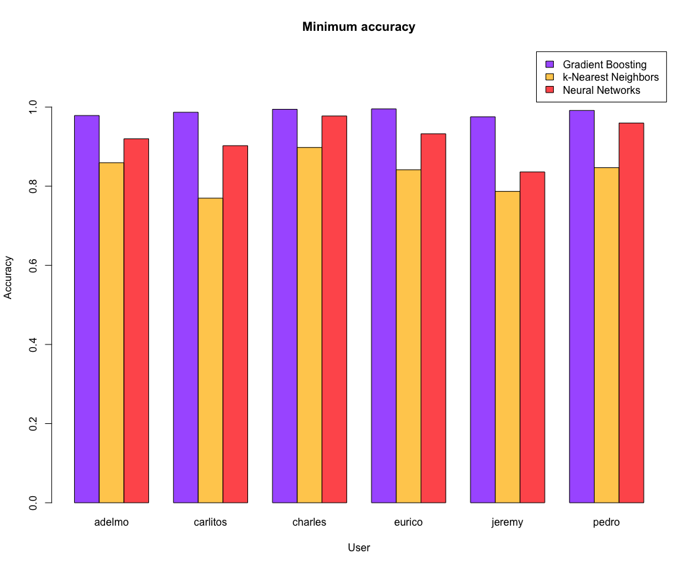
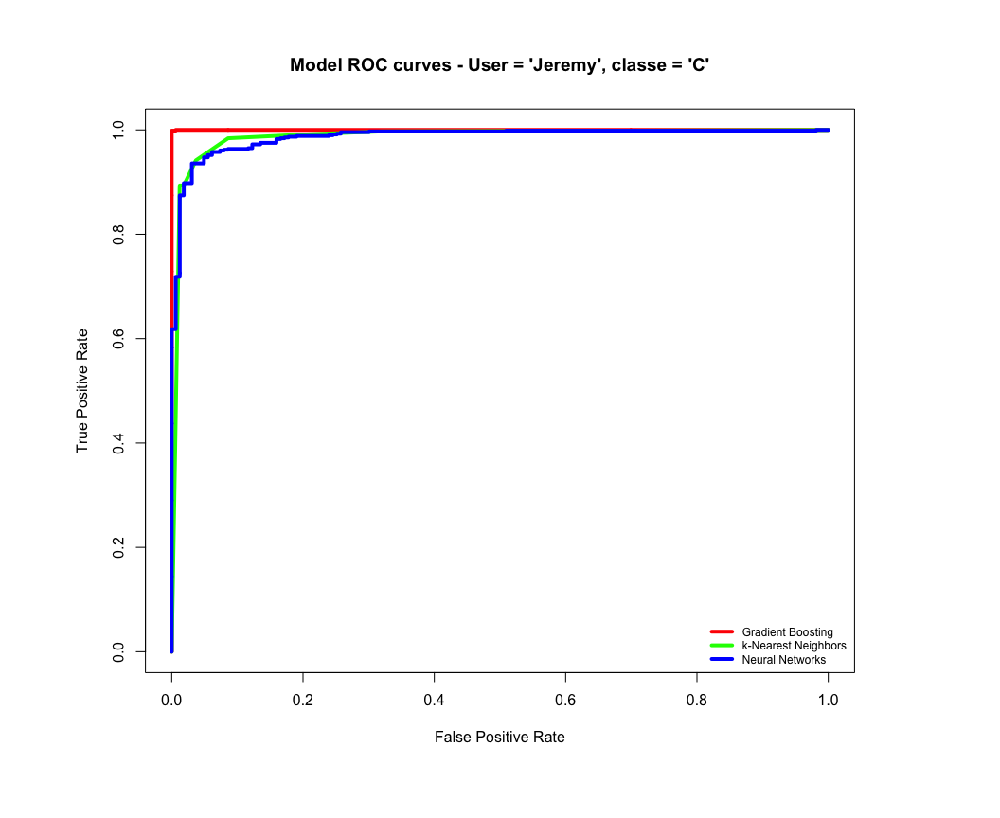

## Practical Machine Learning Project - HAR data analysis

### 1. Synopsis

This document presents the details of the data analysis performed for the 
peer-assessed project of the Practical Machine Learning class.   
The project requires the development of a **predictive model** to be trained on 
a training data set and applied to a test data set with unknown outcomes.   
The details of the problem - **HAR (Human Activity Recognition)** - can be found 
at the [HAR web site](http://groupware.les.inf.puc-rio.br/har).   
The prediction represents a tipical **multi-class classification** machine 
learning problem.   
This HTML documents has been generated using the **knitr** package from an 
R Marknown source and contains all data analysis code (although not echoed).   

### 2. Data Analysis

#### 2.1 Required libraries

The libraries required for the  analysis are: 

* `caret` - Classification and Regression Testing    
* `gbm` - Generalized Boosted Regression Models    
* `nnet` - Feed-forward Neural Networks and Multinomial Log-Linear Models    
* `ROCR` - Scoring Classifiers Performance Visualization    
* `doMC` - Foreach parallel adaptor for the multicore package    

#### 2.2 Data pre-processing

The following steps have been performed to process the original training and 
testing data sets:   

* load the raw data sets from the files **pml-training.csv** and **pml-testing.csv**    
* remove from the raw data sets all columns that have NA values and the columns 1 (row ID) and 3 to 7 (timestamps and windo ID and flags)    
* split each of the data sets by the **user_name**. The result will be a training and a testing list, each with 6 data frame elements    
* remove the **0-variance** (constant) columns (if any) from each element of the training and testing lists   
* split the training set list in 2 different lists using the `createDataPartition` function from the `caret` package. The first list (larger) will be used to **train each model** and the second list (smaller) will be used to **estimate the out-of-sample error** of each trained model     

#### 2.3 Model training

The following three different models have been trained on the training list:    

* **gbm** - **Gradiend Boosting** model trained using the `train` function from the caret package with `method = "gbm"` and one parameter - `verbose = FALSE`    
* **knn** - **k-Nearest Neighbors** model trained using the `train` function with `method = "knn"` and no additional parameters    
* **nnet** - **Feeed-forward Neural Networks** using the `nnet` function from the `nnet` package with 4 parameters - `size = 4`, `maxit = 5000`, `trace = FALSE` and `decay = 0.1`    

During the initial analysis of the data sets, the **Random Forests** model has been used but it has been removed from the final data analysis for performance considerations - it takes a much longer time to train the Random Forests model compared with the above three models and the results are almost identical with two of the above models.    

#### 2.4 Model performance - out-of-sample error estimate

The performance of the three models has been estimated on the test list created during the data pre-processing stage.    
Below are the confusion matrices created for each model and for user **Jeremy**:    

##### Gradient Boosting model confusion matrix for user "jeremy"    
<!-- html table generated in R 3.1.1 by xtable 1.7-3 package -->
<!-- Sun Aug 24 16:10:41 2014 -->
<TABLE border=1>
<TR> <TH>  </TH> <TH> A </TH> <TH> B </TH> <TH> C </TH> <TH> D </TH> <TH> E </TH>  </TR>
  <TR> <TD align="right"> A </TD> <TD align="right"> 290 </TD> <TD align="right">   3 </TD> <TD align="right">   0 </TD> <TD align="right">   0 </TD> <TD align="right">   0 </TD> </TR>
  <TR> <TD align="right"> B </TD> <TD align="right">   4 </TD> <TD align="right"> 119 </TD> <TD align="right">   0 </TD> <TD align="right">   0 </TD> <TD align="right">   0 </TD> </TR>
  <TR> <TD align="right"> C </TD> <TD align="right">   0 </TD> <TD align="right">   0 </TD> <TD align="right"> 163 </TD> <TD align="right">   1 </TD> <TD align="right">   0 </TD> </TR>
  <TR> <TD align="right"> D </TD> <TD align="right">   0 </TD> <TD align="right">   0 </TD> <TD align="right">   0 </TD> <TD align="right"> 128 </TD> <TD align="right">   0 </TD> </TR>
  <TR> <TD align="right"> E </TD> <TD align="right">   0 </TD> <TD align="right">   0 </TD> <TD align="right">   0 </TD> <TD align="right">   1 </TD> <TD align="right"> 140 </TD> </TR>
   </TABLE>
    
##### k-Nearest Neighbors model confusion matrix for user "jeremy"    
<!-- html table generated in R 3.1.1 by xtable 1.7-3 package -->
<!-- Sun Aug 24 16:10:41 2014 -->
<TABLE border=1>
<TR> <TH>  </TH> <TH> A </TH> <TH> B </TH> <TH> C </TH> <TH> D </TH> <TH> E </TH>  </TR>
  <TR> <TD align="right"> A </TD> <TD align="right"> 280 </TD> <TD align="right">   9 </TD> <TD align="right">   1 </TD> <TD align="right">   1 </TD> <TD align="right">   2 </TD> </TR>
  <TR> <TD align="right"> B </TD> <TD align="right">   3 </TD> <TD align="right">  96 </TD> <TD align="right">   2 </TD> <TD align="right">   0 </TD> <TD align="right">   2 </TD> </TR>
  <TR> <TD align="right"> C </TD> <TD align="right">   5 </TD> <TD align="right">   9 </TD> <TD align="right"> 149 </TD> <TD align="right">   1 </TD> <TD align="right">   2 </TD> </TR>
  <TR> <TD align="right"> D </TD> <TD align="right">   4 </TD> <TD align="right">   2 </TD> <TD align="right">   6 </TD> <TD align="right"> 126 </TD> <TD align="right">   2 </TD> </TR>
  <TR> <TD align="right"> E </TD> <TD align="right">   2 </TD> <TD align="right">   6 </TD> <TD align="right">   5 </TD> <TD align="right">   2 </TD> <TD align="right"> 132 </TD> </TR>
   </TABLE>
    
##### Neural Networks model confusion matrix for user "jeremy"    
<!-- html table generated in R 3.1.1 by xtable 1.7-3 package -->
<!-- Sun Aug 24 16:10:41 2014 -->
<TABLE border=1>
<TR> <TH>  </TH> <TH> A </TH> <TH> B </TH> <TH> C </TH> <TH> D </TH> <TH> E </TH>  </TR>
  <TR> <TD align="right"> A </TD> <TD align="right"> 276 </TD> <TD align="right">  10 </TD> <TD align="right">   4 </TD> <TD align="right">   0 </TD> <TD align="right">   0 </TD> </TR>
  <TR> <TD align="right"> B </TD> <TD align="right">  10 </TD> <TD align="right"> 102 </TD> <TD align="right">   0 </TD> <TD align="right">   0 </TD> <TD align="right">   0 </TD> </TR>
  <TR> <TD align="right"> C </TD> <TD align="right">   1 </TD> <TD align="right">   3 </TD> <TD align="right"> 141 </TD> <TD align="right">   1 </TD> <TD align="right">  13 </TD> </TR>
  <TR> <TD align="right"> D </TD> <TD align="right">   7 </TD> <TD align="right">   1 </TD> <TD align="right">   6 </TD> <TD align="right"> 126 </TD> <TD align="right">   2 </TD> </TR>
  <TR> <TD align="right"> E </TD> <TD align="right">   0 </TD> <TD align="right">   6 </TD> <TD align="right">  12 </TD> <TD align="right">   3 </TD> <TD align="right"> 125 </TD> </TR>
   </TABLE>
    
The following bar graph shows the minimum accuracy level of each of the three models for each element (user) of the testing list:    
    

As it can be seen from the plot above, all models perform very well but the **Gradient Boosting** model has an accuracy close to 100%

Same conclusion can be reached from the ROC curves plotted in the followin graph:    
    
 
     
### 3. Results - model-based prediction
             

    
The following table shows the predictions for all problems in the test data set using each of the trained models:    
    
<!-- html table generated in R 3.1.1 by xtable 1.7-3 package -->
<!-- Sun Aug 24 16:10:43 2014 -->
<TABLE border=1>
<TR> <TH> Problem ID </TH> <TH> Gradient Boosting </TH> <TH> k-Nearest Neighbors </TH> <TH> Neural Networks </TH>  </TR>
  <TR> <TD align="right">   1 </TD> <TD> B </TD> <TD> B </TD> <TD> B </TD> </TR>
  <TR> <TD align="right">   2 </TD> <TD> A </TD> <TD> A </TD> <TD> A </TD> </TR>
  <TR> <TD align="right">   3 </TD> <TD> B </TD> <TD> B </TD> <TD> A </TD> </TR>
  <TR> <TD align="right">   4 </TD> <TD> A </TD> <TD> A </TD> <TD> A </TD> </TR>
  <TR> <TD align="right">   5 </TD> <TD> A </TD> <TD> A </TD> <TD> A </TD> </TR>
  <TR> <TD align="right">   6 </TD> <TD> E </TD> <TD> E </TD> <TD> E </TD> </TR>
  <TR> <TD align="right">   7 </TD> <TD> D </TD> <TD> D </TD> <TD> D </TD> </TR>
  <TR> <TD align="right">   8 </TD> <TD> B </TD> <TD> B </TD> <TD> B </TD> </TR>
  <TR> <TD align="right">   9 </TD> <TD> A </TD> <TD> A </TD> <TD> A </TD> </TR>
  <TR> <TD align="right">  10 </TD> <TD> A </TD> <TD> A </TD> <TD> A </TD> </TR>
  <TR> <TD align="right">  11 </TD> <TD> B </TD> <TD> B </TD> <TD> B </TD> </TR>
  <TR> <TD align="right">  12 </TD> <TD> C </TD> <TD> C </TD> <TD> C </TD> </TR>
  <TR> <TD align="right">  13 </TD> <TD> B </TD> <TD> B </TD> <TD> B </TD> </TR>
  <TR> <TD align="right">  14 </TD> <TD> A </TD> <TD> A </TD> <TD> A </TD> </TR>
  <TR> <TD align="right">  15 </TD> <TD> E </TD> <TD> E </TD> <TD> E </TD> </TR>
  <TR> <TD align="right">  16 </TD> <TD> E </TD> <TD> E </TD> <TD> E </TD> </TR>
  <TR> <TD align="right">  17 </TD> <TD> A </TD> <TD> A </TD> <TD> A </TD> </TR>
  <TR> <TD align="right">  18 </TD> <TD> B </TD> <TD> B </TD> <TD> B </TD> </TR>
  <TR> <TD align="right">  19 </TD> <TD> B </TD> <TD> B </TD> <TD> B </TD> </TR>
  <TR> <TD align="right">  20 </TD> <TD> B </TD> <TD> B </TD> <TD> B </TD> </TR>
   </TABLE>
    
The **Neural Networks** model makes a different prediction for **problem ID 3** and agrees with the other 2 models on the other problems. The **Gradient Boosting** and the **k-Nearest Neighbors** models **agree on ALL problems**. The prediction result submitted is the one on which the first two models agree (the first 2 columns of the above table).

